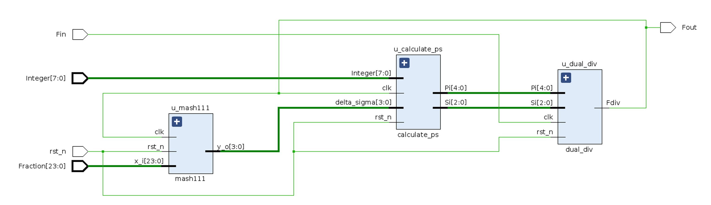

# Fractional-N-DIV
A Fractional Divider with Delta-Sigma Modulator and Dual-Mode Divider for Phase-Locked Loop.

## Tree

~~~bash
.
├── delta-sigma            # delta-sigma
│   ├── rtl                # verilog 代码
│   ├── tb                 # testbench
├── dual-div               # 双模分频器
│   ├── rtl
│   ├── tb
├── FractionalN            # top
│   ├── rtl
│   └── tb
├── pic
│   ├── diagram            # 系统框图
│   ├── test_res           # 仿真测试结果
│   └── wave               # 波形图
├── doc
└── README.md
~~~
