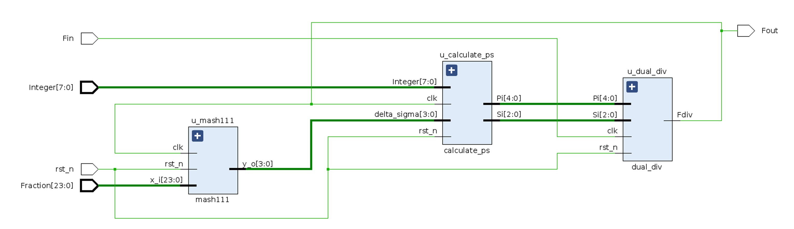

# Fractional-N-DIV
A Fractional Divider with Delta-Sigma Modulator and Dual-Mode Divider for Phase-Locked Loop.

## Tree

~~~bash
|____Fractional-N-DIV
| |____test_res               # 仿真测试结果
| |____delta-sigma            # delta-sigma
| | |____tb                   # testbench
| | |____rtl                  # verilog 代码
| |____dual-div               # 双模分频器
| | |____tb
| | |____rtl
| |____FractionalN            # top
| | |____tb
| | |____rtl
~~~
